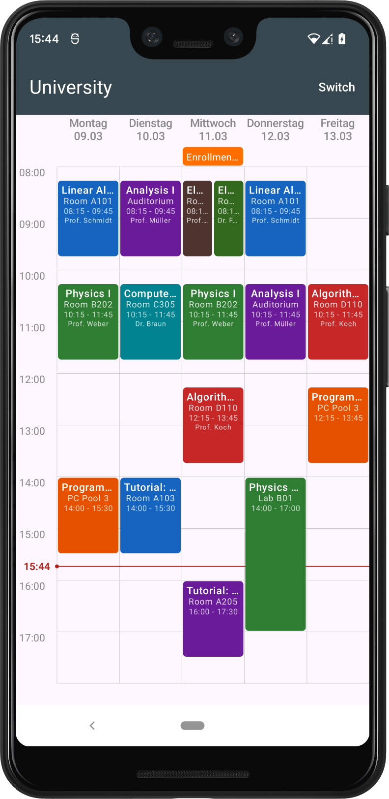
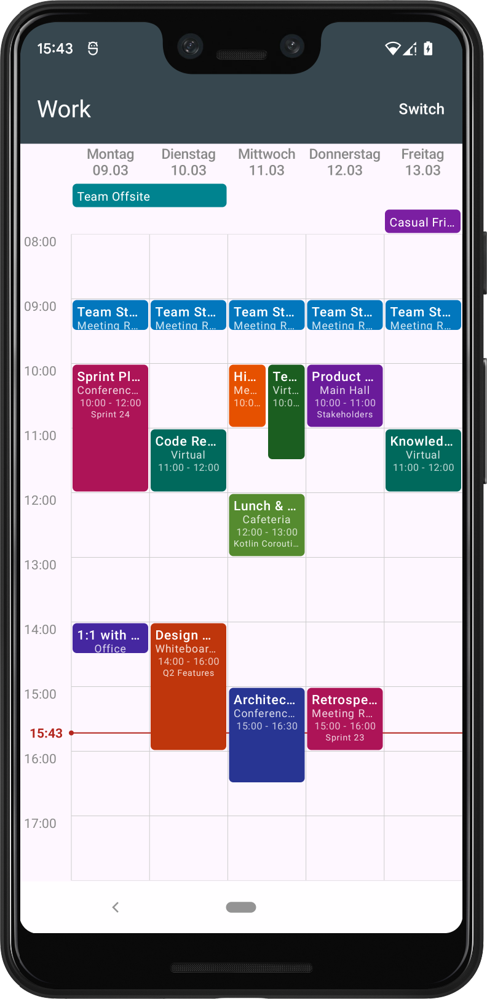
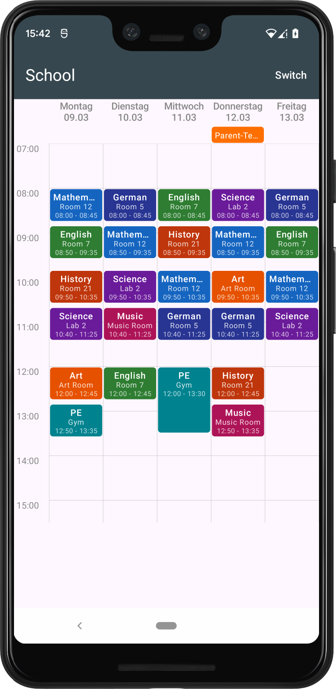
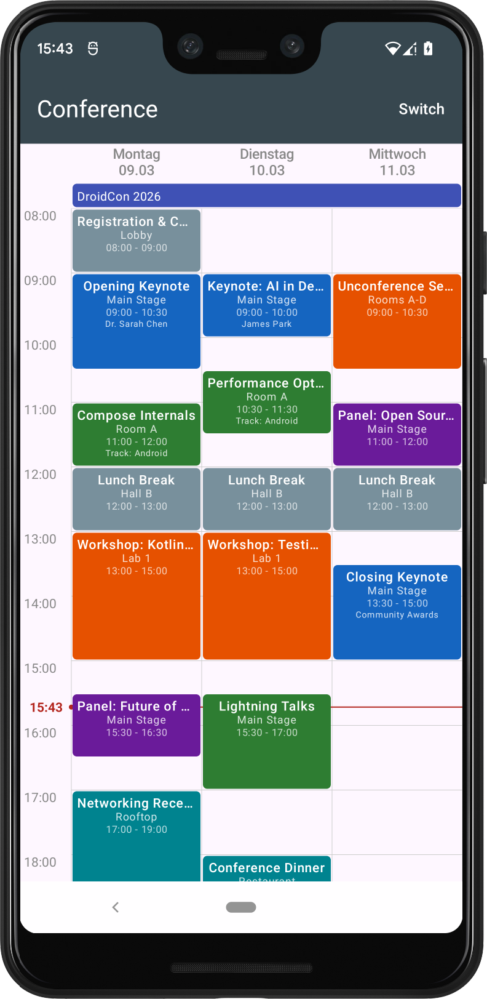

[](https://jitpack.io/#tobiasschuerg/android-week-view)
[](https://github.com/tobiasschuerg/android-week-view/actions/workflows/build.yml)

# Android Week View

Kotlin Android library for displaying weekly schedules and timetables using Jetpack Compose.

Initially created for [Schedule Deluxe](https://play.google.com/store/apps/details?id=com.tobiasschuerg.stundenplan), this library provides a flexible week view component for calendar apps, timetables, and schedule management.

## Screenshots

| University | Work | School | Conference (3-day) |
|:---:|:---:|:---:|:---:|
|  |  |  |  |

## Features

- Jetpack Compose implementation (Compose-only since 3.0)
- Three event types: timed, all-day, and multi-day (spanning bars)
- Automatic overlap handling for concurrent events
- Pinch-to-zoom
- Current time indicator and day highlighting
- Configurable event display, spacing, and time range
- Flexible day counts (3-day, 5-day, 7-day, etc.)
- Navigation handled externally for full control (e.g. `HorizontalPager`, buttons)

## Usage

### Add to your Compose UI

```kotlin
@Composable
fun MyWeekView() {
    val dateRange = LocalDateRange(
        LocalDate.now().with(DayOfWeek.MONDAY),
        LocalDate.now().with(DayOfWeek.FRIDAY),
    )
    val weekData = remember {
        WeekData(dateRange, LocalTime.of(8, 0), LocalTime.of(18, 0))
    }

    WeekViewCompose(
        weekData = weekData,
        weekViewConfig = WeekViewConfig(),
        eventConfig = EventConfig(),
        actions = WeekViewActions(
            onEventClick = { event -> /* Handle click */ },
            onEventLongPress = { event -> /* Handle long press */ },
        ),
    )
}
```

### Create events

```kotlin
// Timed event
val meeting = Event.Single(
    id = "1",
    date = LocalDate.of(2026, 1, 15),
    title = "Team Meeting",
    shortTitle = "Meeting",
    timeSpan = TimeSpan.of(LocalTime.of(10, 0), Duration.ofHours(1)),
    backgroundColor = Color.BLUE,
    textColor = Color.WHITE,
)

// All-day event
val holiday = Event.AllDay(
    id = "2",
    date = LocalDate.of(2026, 1, 16),
    title = "National Holiday",
    shortTitle = "Holiday",
    backgroundColor = Color.GREEN,
    textColor = Color.WHITE,
)

// Multi-day event (renders as a spanning bar)
val conference = Event.MultiDay(
    id = "3",
    date = LocalDate.of(2026, 1, 20),
    title = "Tech Conference",
    shortTitle = "Conf",
    lastDate = LocalDate.of(2026, 1, 22),
    backgroundColor = Color.MAGENTA,
    textColor = Color.WHITE,
)

weekData.add(meeting)
weekData.add(holiday)
weekData.add(conference)
```

Event IDs must be unique across all event types in a `WeekData`. If your events come from several sources (for example two database tables with their own auto-increment keys), prefix the IDs, e.g. `"lesson-12"` and `"holiday-12"`.

## Customization

### Week View Configuration

```kotlin
val weekViewConfig = WeekViewConfig(
    scalingFactor = 1.2f,
    showCurrentTimeIndicator = true,
    highlightCurrentDay = true,
)
```

### Event Configuration

```kotlin
val eventConfig = EventConfig(
    showSubtitle = true,
    showTimeStart = true,
    showTimeEnd = true,
    eventSpacingDp = 1, // gap between adjacent events (0 to disable)
)
```

Events adapt their layout to the available height automatically, dropping fields by
priority (name > start time > end time > location > teacher) rather than clipping
whatever renders first. The decision uses the real line heights, so it stays correct
under any system font scale:

- The name is always shown and shrinks to fit when the entry is very low or narrow.
- Start and end time are never combined into one line (that does not fit a five-day
  phone column). When the entry is tall enough they are stacked with the name - start
  above, end pinned to the bottom right; when it isn't, they move into the top-left and
  bottom-right corners as smaller labels, keeping only the start time once both would
  crowd out the name; only very low entries drop them entirely. Labels that don't fit
  a narrow overlap column even at their smallest size are hidden rather than clipped.
- Location and teacher are added back in as the entry gets taller.
- The title wraps onto a second line instead of eliding once there's room to spare.

### Custom Event Design

Pass `eventContent` to replace how timed entries look. The week view still positions and
sizes each entry, handles clicks and sets its accessibility description; the slot only
draws inside it, including the background and shape. `EventContentScope` provides the
event, the entry's `width` and `height`, the `EventConfig` and the locale.

```kotlin
WeekViewCompose(
    weekData = weekData,
    weekViewConfig = WeekViewConfig(),
    eventContent = { scope ->
        Box(
            Modifier
                .fillMaxSize()
                .background(Color(scope.event.backgroundColor), RoundedCornerShape(8.dp))
                .padding(4.dp),
        ) {
            Text(scope.event.title)
        }
    },
)
```

The library ships three ready-made styles. All of them fit the fields to the entry height as
described above; they only differ in container and colors:

| Style | Look |
|---|---|
| `FilledEventContent` (default) | Filled with the event's background color, text in its text color |
| `TintedEventContent` | Light tint of the event color with a full-color bar on the left |
| `OutlinedEventContent` | Theme surface with a border in the event color |

```kotlin
WeekViewCompose(
    weekData = weekData,
    weekViewConfig = WeekViewConfig(),
    eventContent = { TintedEventContent(it) },
)
```

Built-in styles can also be mixed with your own, e.g. a custom design for some events only.
All-day and multi-day events are not affected.

### Callbacks

```kotlin
val actions = WeekViewActions(
    onEventClick = { event -> /* Handle event tap */ },
    onEventLongPress = { event -> /* Handle long press */ },
    onScalingFactorChange = { factor -> /* Persist zoom level */ },
)
```

## Installation

### Step 1: Add JitPack repository

In your **settings.gradle.kts**:

```kotlin
dependencyResolutionManagement {
    repositories {
        // ... other repositories
        maven { url = uri("https://jitpack.io") }
    }
}
```

### Step 2: Add the dependency

In your **app** `build.gradle.kts`, replacing `<version>` with the latest release shown by the JitPack badge above:

```kotlin
dependencies {
    implementation("com.github.tobiasschuerg:android-week-view:<version>")

    // Required for Compose
    implementation(platform("androidx.compose:compose-bom:<compose-bom-version>"))
    implementation("androidx.compose.ui:ui")
    implementation("androidx.compose.material3:material3")
}
```

## Releases

Changes for each version are listed on the [GitHub Releases](https://github.com/tobiasschuerg/android-week-view/releases) page.

## Sample App

The `app/` module contains a sample app with five built-in timetables (University, Work, School, Conference, Special Cases) demonstrating different layouts, overlapping events, all-day/multi-day events, a 3-day view, and rendering edge cases like very short entries and long titles. Switch between them via the top app bar menu.

## Contributing

Contributions are welcome! Please:

1. Fork the repository
2. Create a feature branch
3. Run `./gradlew ktlintFormat` before committing
4. Add tests for new functionality
5. Submit a pull request

## Links

- **JitPack**: https://jitpack.io/#tobiasschuerg/android-week-view
- **Sample App**: See `app/` module in this repository
- **Issues**: https://github.com/tobiasschuerg/android-week-view/issues
